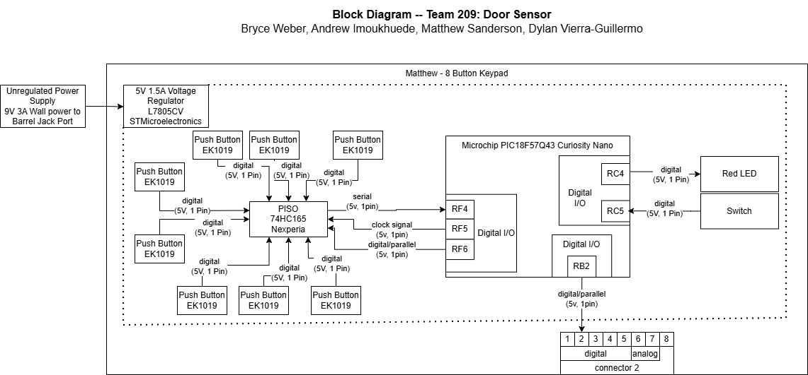

## Overview
Parts of the block diagram:

* 8 EK1019 buttons
* 74HC165 PISO
* LM7805 Voltage Regulator
* Digital 2 output
* 5V power from PIC Curiosity Nano board

## My Block Diagram 

## Breakdown
The 8 buttons and the shift register help meet the team product requirements by being an input device for the user to interact with our door sensor system. It allows the user to unlock the door.
