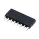
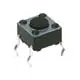

## Components

*Table 1: Shift Register Options*

**8-Bit Parallel in Serial out (PISO) Shift Register**

| **Solution**                                                                                                                                                                                      | **Pros**                                                                                                                                    | **Cons**                                                                                            |
| ------------------------------------------------------------------------------------------------------------------------------------------------------------------------------------------------- | ------------------------------------------------------------------------------------------------------------------------------------------- | --------------------------------------------------------------------------------------------------- |
|  \* Option 1. \* 74HC165-Q100 surface mount shift register \* $0.24/each \* [link to product](https://www.mouser.com/ProductDetail/Nexperia/74HC165D-Q100118?qs=sGAEpiMZZMutXGli8Ay4kD1Rik6g2cV%252B%252BQvCmhxAH0s%3D)                 | \* Inexpensive \* Directly outputs serial \* Meets surface mount constraint of project                                               | \* Slow shipping speed \* Needs special PCB layout. |
|  \* Option 2.  \* 74HC595D surface mount shift register  \* $0.63/each  \* [Link to product](https://www.mouser.com/ProductDetail/Toshiba/74HC595DBJ?qs=T%2FywbITssnTkqd02WdSNRg%3D%3D) | \* Meets surface mount constraint of project  \* High noise immunity   \* Directly outputs serial | * Exceeding absolute max ratings, even briefly lead to deterioration  \* Slow shipping speed                                                         |
|  \* Option 3.  \* SN74HCS165 surface mount shift register  \* $1.52/each  \* [Link to product](https://www.mouser.com/ProductDetail/Texas-Instruments/SN74HCS165DRG4?qs=vOcB1WHNNXLF%2FP4%252BuTSdXQ%3D%3D) | \* Meets surface mount constraint of project  \* Wide operating voltage range 2V to 6V   \* Directly outputs serial | * More expensive  \* Slow shipping speed                                                         |

**Choice:** Option 1: 74HC165-Q100 surface mount shift register

**Rationale:** This shift register is the cheapest option and is not missing any needed features. The added benefits of the more expensive options do not add anything ciritical for this project so do not make sense to choose.

*Table 2: Push Button Options*

**Push Button**

| **Solution**                                                                                                                                                                                      | **Pros**                                                                                                                                    | **Cons**                                                                                            |
| ------------------------------------------------------------------------------------------------------------------------------------------------------------------------------------------------- | ------------------------------------------------------------------------------------------------------------------------------------------- | --------------------------------------------------------------------------------------------------- |
|  \* Option 1. \* The PTS645 switch series are 6mm tactile switches  \* $0.28/each \* [link to product](https://www.mouser.com/ProductDetail/CK/PTS645SL50-2-LFS?qs=rqnA19JZHeTZYaJU%252B5olWA%3D%3D)                 | \* Inexpensive \* Has long life expectancy \* Low power requirement                                               | \* Slow shipping speed \* Needs special PCB layout. |
|  \* Option 2.  \* 74HC595D surface mount shift register  \* $0.63/each  \* [Link to product](https://www.mouser.com/ProductDetail/Toshiba/74HC595DBJ?qs=T%2FywbITssnTkqd02WdSNRg%3D%3D) | \* Meets surface mount constraint of project  \* High noise immunity   \* Directly outputs serial | * Exceeding absolute max ratings, even briefly lead to deterioration  \* Slow shipping speed                                                         |
|  \* Option 3.  \* SN74HCS165 surface mount shift register  \* $1.52/each  \* [Link to product](https://www.mouser.com/ProductDetail/Texas-Instruments/SN74HCS165DRG4?qs=vOcB1WHNNXLF%2FP4%252BuTSdXQ%3D%3D) | \* Meets surface mount constraint of project  \* Wide operating voltage range 2V to 6V   \* Directly outputs serial | * More expensive  \* Slow shipping speed                                                         |

*Table 3: Voltage Regulator Options*

**Voltage Regulator**

| **Solution**                                                                                                                                                                                      | **Pros**                                                                                                                                    | **Cons**                                                                                            |
| ------------------------------------------------------------------------------------------------------------------------------------------------------------------------------------------------- | ------------------------------------------------------------------------------------------------------------------------------------------- | --------------------------------------------------------------------------------------------------- |
|  \* Option 1. \* 74HC165-Q100 surface mount shift register \* $0.28/each \* [link to product](https://www.mouser.com/ProductDetail/Nexperia/74HC165D-Q100118?qs=sGAEpiMZZMutXGli8Ay4kD1Rik6g2cV%252B%252BQvCmhxAH0s%3D)                 | \* Inexpensive \* Directly outputs serial \* Meets surface mount constraint of project                                               | \* Slow shipping speed \* Needs special PCB layout. |
|  \* Option 2.  \* 74HC595D surface mount shift register  \* $0.63/each  \* [Link to product](https://www.mouser.com/ProductDetail/Toshiba/74HC595DBJ?qs=T%2FywbITssnTkqd02WdSNRg%3D%3D) | \* Meets surface mount constraint of project  \* High noise immunity   \* Directly outputs serial | * Exceeding absolute max ratings, even briefly lead to deterioration  \* Slow shipping speed                                                         |
|  \* Option 3.  \* SN74HCS165 surface mount shift register  \* $1.52/each  \* [Link to product](https://www.mouser.com/ProductDetail/Texas-Instruments/SN74HCS165DRG4?qs=vOcB1WHNNXLF%2FP4%252BuTSdXQ%3D%3D) | \* Meets surface mount constraint of project  \* Wide operating voltage range 2V to 6V   \* Directly outputs serial | * More expensive  \* Slow shipping speed                                                         |
