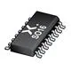
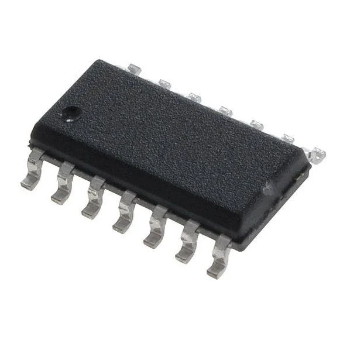

## Components

*Table 1: Shift Register Options*

**8-Bit Parallel in Serial out (PISO) Shift Register**

| **Solution**                                                                                                                                                                                      | **Pros**                                                                                                                                    | **Cons**                                                                                            |
| ------------------------------------------------------------------------------------------------------------------------------------------------------------------------------------------------- | ------------------------------------------------------------------------------------------------------------------------------------------- | --------------------------------------------------------------------------------------------------- |
|  \* Option 1. \* 74HC165-Q100 surface mount shift register \* $0.28/each \* [link to product](https://www.mouser.com/ProductDetail/Nexperia/74HC165D-Q100118?qs=sGAEpiMZZMutXGli8Ay4kD1Rik6g2cV%252B%252BQvCmhxAH0s%3D)                 | \* Inexpensive \* Directly outputs serial \* Meets surface mount constraint of project                                               | \* Slow shipping speed \* Needs special PCB layout. |
|  \* Option 2.  \* 74HC595D surface mount shift register  \* $0.63/each  \* [Link to product](https://www.mouser.com/ProductDetail/Toshiba/74HC595DBJ?qs=T%2FywbITssnTkqd02WdSNRg%3D%3D) | \* Meets surface mount constraint of project  \* Can work over power through curiosity nano   \* Directly outputs serial | * More expensive  \* Slow shipping speed                                                         |

**Choice:** Option 2: CTX936TR-ND surface mount oscillator

**Rationale:** A clock oscillator is easier to work with because it requires no external circuitry in order to interface with the PSoC. This is particularly important because we are not sure of the electrical characteristics of the PCB, which could affect the oscillation of a crystal. While the shipping speed is slow, according to the website if we order this week it will arrive within 3 weeks.

### Style 2

> Also acceptable, more markdown friendly

**External Clock Module**

1. XC1259TR-ND surface mount crystal

    

    * $1/each
    * [link to product](http://www.digikey.com/product-detail/en/ECS-40.3-S-5PX-TR/XC1259TR-ND/827366)

    | Pros                                      | Cons                                                             |
    | ----------------------------------------- | ---------------------------------------------------------------- |
    | Inexpensive                               | Requires external components and support circuitry for interface |
    | Compatible with PSoC                      | Needs special PCB layout.                                        |
    | Meets surface mount constraint of project |

1. CTX936TR-ND surface mount oscillator

    

    * $1/each
    * [Link to product](http://www.digikey.com/product-detail/en/636L3I001M84320/CTX936TR-ND/2292940)

    | Pros                                                              | Cons                |
    | ----------------------------------------------------------------- | ------------------- |
    | Outputs a square wave                                             | More expensive      |
    | Stable over operating temperature                                 | Slow shipping speed |
    | Direct interface with PSoC (no external circuitry required) range |

**Choice:** Option 2: CTX936TR-ND surface mount oscillator

**Rationale:** A clock oscillator is easier to work with because it requires no external circuitry in order to interface with the PSoC. This is particularly important because we are not sure of the electrical characteristics of the PCB, which could affect the oscillation of a crystal. While the shipping speed is slow, according to the website if we order this week it will arrive within 3 weeks.
