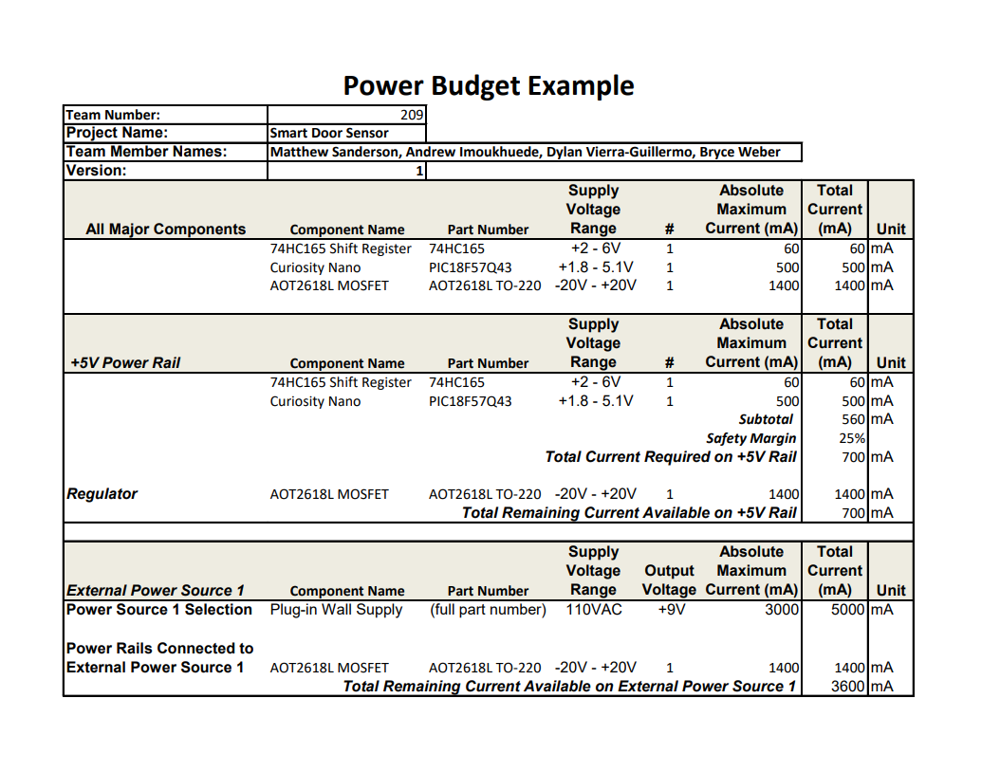

## Overview
Here is a breakdown of how much power every major component of my subsystem uses. The main power draw is the Curiosity Nano board, while the shift register uses very little power.

{style width:"350" height:"300;"}

## Conclusions

From the prepared Power Budget, we can conclude that pulling power solely from a wall outlet should be more than enough for the circuit to run correctly. Given the low power requirements for everything even at max current draw it is very likely that my subsystem could be battery powered in a future design.

## Resouces

The power budget as a PDF download is available [*here*](PowerBudget.pdf), and a Microsoft Excel Sheet [*here*](PowerBudget.xlsx).
