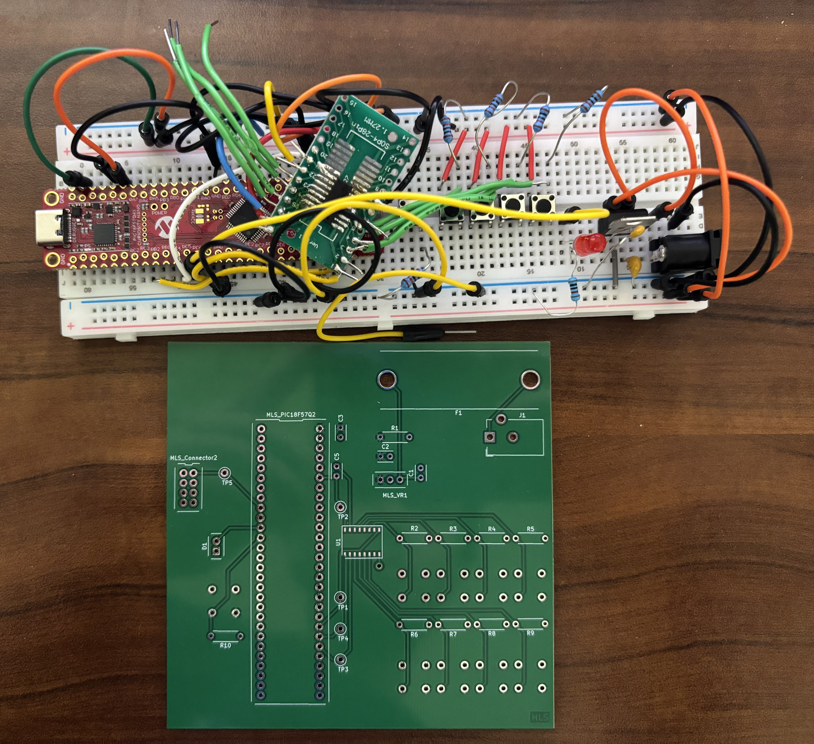

Matthew Sanderson Datasheet 
as part of 
Smart Door Sensor 
for 
 Team 209  

**Submission: September, 3, 2025**

## Introduction

* This datasheet shows the details for Matthew Sanderson's portion of the Smart Door Sensor.

### Project Summary

* Team 209 is a collaborative engineering group dedicated to pushing the boundaries of home security through innovative technology. We aim to design and build an electronic door sensor that automatically locks the door after you close it. This device will provide convenience and security by letting you know your house is safely locked when you leave.
Through this project, we seek not only to create a functional and reliable prototype but also to develop as a cohesive team, applying engineering practices and innovative thinking, to deliver a product with real-world impact.
* The full project website can be viewed here [team report.](https://asu-egr304-2025-f-209.github.io/)

### My Contribution

* My portion of this project was focused on creating a keypad that will control the door lock.

**Figure 01** Mathew's Design
